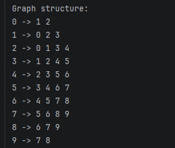
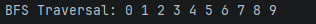
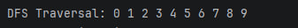
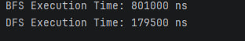

# Assignment 4 — Graph Traversal and Representation System

## Project Overview

This project demonstrates graph representation and traversal algorithms using Java.

The graph is implemented using an adjacency list structure.

The project includes:

- Vertex class
- Edge class
- Graph class
- Breadth-First Search (BFS)
- Depth-First Search (DFS)
- Performance analysis using System.nanoTime()

The project tests graph traversal on:

- Small graph (10 vertices)
- Medium graph (30 vertices)
- Large graph (100 vertices)

---

# Graph Structure

A graph consists of:

- Vertices (nodes)
- Edges (connections between nodes)

The adjacency list stores neighbors for every vertex.

Example:

0 -> 1 2  
1 -> 0 2 3  
2 -> 0 1 3

---

# Class Descriptions

## Vertex Class

Represents a graph node.

### Fields

- id

### Methods

- Constructor
- Getter
- toString()

---

## Edge Class

Represents a connection between two vertices.

### Fields

- source
- destination

### Methods

- Constructor
- Getters
- toString()

---

## Graph Class

Stores the graph using adjacency list representation.

### Methods

- addVertex()
- addEdge()
- printGraph()
- bfs()
- dfs()

---

# Algorithm Descriptions

## Breadth-First Search (BFS)

BFS visits vertices level by level.

### Steps

1. Start from selected vertex
2. Add vertex to queue
3. Visit all neighbors
4. Continue until queue is empty

### Use Cases

- Shortest path
- Network traversal
- Social media connections

### Time Complexity

O(V + E)

Where:

- V = number of vertices
- E = number of edges

---

## Depth-First Search (DFS)

DFS explores one branch deeply before backtracking.

### Steps

1. Start from selected vertex
2. Visit neighbor recursively
3. Continue deeper
4. Backtrack when needed

### Use Cases

- Path finding
- Maze solving
- Cycle detection

### Time Complexity

O(V + E)

---

# Experimental Results

| Graph Size | BFS Time (ns) | DFS Time (ns) |
|------------|---------------|---------------|
| 10         | 801000        | 179500        |
| 30         | 325400        | 318400        |
| 100        | 753100        | 563700        |

---

# Observations

- As the graph size increases, the execution time also increases.
- DFS was faster than BFS in most experiments.
- Both algorithms demonstrated linear growth close to O(V + E).
- BFS and DFS produced the same traversal order because the graph structure is almost linear.

---

# Analysis Questions

## How does graph size affect BFS and DFS performance?

As graph size increases, traversal time also increases because more vertices and edges must be processed.

---

## Which traversal is faster?

DFS was slightly faster in most tests because recursion can reduce queue management overhead.

---

## Do results match O(V + E)?

Yes. Both algorithms increase approximately linearly with graph size.

---

## How does graph structure affect traversal order?

BFS visits level by level, while DFS explores deeper paths first.

---

## When is BFS preferred over DFS?

BFS is preferred when searching for the shortest path.

---

## What are limitations of DFS?

DFS may go too deep and consume stack memory in very large graphs.

---

# Screenshots

## Graph Structure

---

## BFS Traversal

---

## DFS Traversal

---

## Performance Results

---

# Reflection

This assignment helped me understand graph traversal algorithms and graph representation using adjacency lists.

I learned that BFS and DFS have different traversal behaviors even though both have the same theoretical complexity.

One challenge was implementing recursive DFS correctly and avoiding revisiting vertices.

Another challenge was organizing the project using clean OOP principles.

---

# Example Git Commits

- init: project structure
- feat(vertex): implemented Vertex class
- feat(edge): added Edge class
- feat(graph): implemented adjacency list
- feat(traversal): added BFS and DFS
- feat(experiment): added performance testing
- docs(readme): added analysis and results
- perf(cleanup): improved code
- release: v1.0